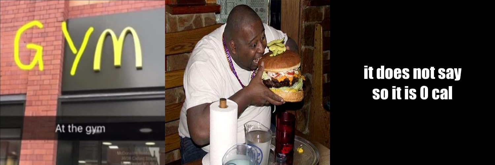

# Introduction

welcome to my meme, it is the first meme i have ever made.

## Some ideas of my meme

China now has a new video maker who is a fitness enthusiast. 
He will take videos of himself eating cheat meals. 
In most of his videos, he will observe his food and say that there is no calories written on the food, so it is 0 calories. 
Therefore, the phrase **"it does not say so it is 0 cal"** is very popular in China now.

## here is my meme



* here is the picture i have used from other website

1. it is the first picture


2. it is the second picture


* here is my R code

i made it use R package [{magick}](https://cran.r-project.org/web/packages/magick/vignettes/intro.html).

```
library(magick)
gym<- image_read("https://images7.memedroid.com/images/UPLOADED552/60326854c7f05.jpeg")%>%image_scale(500)
humberger<-image_read("http://cdn0.vox-cdn.com/uploads/chorus_asset/file/1252870/huge-burger.0.jpg")%>%image_scale(500)
text<-image_blank(width = 500, 
                  height = 500, 
                  color = "#000000") %>%
  image_annotate(text = "it does not say\nso it is 0cal",
                 color = "#FFFFFF",
                 size = 50,
                 font = "Impact",
                 gravity = "center")
meme<-c(gym,humberger,text) %>%
  image_append()
meme
image_write(meme,"my_meme.png")
```

_The second person in the picture is not the vlogger I mentioned before._
